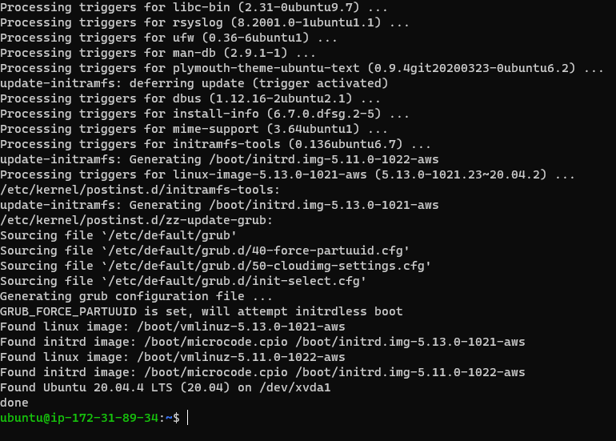
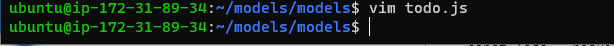

# Documentation of project3
## Step  1
1. I updated ubuntu

   `sudo apt update`
   

2. I upgraded ubuntu

   `sudo apt upgrade`

   

3. I got the location of node-js software
   `curl -sL https://deb.nodesource.com/setup_12.x | sudo -E bash -`

    

4. I installed node.js
   `sudo apt-get install -y nodejs`

   

5.  I verified the node installation
   `node -v`

   
   
   `npm -v`
   

6. I created a Todo directory
   `mkdir Todo`

   

7. I verified if it  was created
   `ls`

   

8. I changed my current directory to Todo directory
   
   `cd Todo`

   

9. I initialised my project

   `npm init`
   

10. I confirmed if package.json file was created during the process
    
    `ls`
    

## Step 2
1. I installed express using npm
   `npm install express`

   

2. I created a file named 'index.js'

   `touch index.js`
   
    

3. I installed dotenv module
   `npm install dotenv`

   

4. I opened the file and inputed the required codes
   `sudo vim index.js`

   

5. I started my server to see if it works
   `node index.js`

   

6. I accessed my public ip address on my browser
  
  `http://<PublicIP-or-PublicDNS>:5000`
   
   

7. I created a routes directory
   
   `mkdir routes`
   

8. I changed the current directory to the one I just created
     `cd routes`
     

9.  I created a new file 
    
    `touch api.js`
    

10.  I opened the file and inserted the required codes, then I saved it
     
     `sudo vim api.js`

     

## Step 3
1. I changed the directory back to 'Todo' and installed mongoose

   `npm install mongoose`
   

2. I created 'models' directory
    `mkdir models`
    

3. I changed directory into the newly created folder
    `cd models`
    

4. I created a file and named it todo.js
   `touch todo.js`
   

5. I opened the file created and pasted the required codes
   `sudo vim todo.js`
   

6. Then, I updated the file in the routes directory
   `sudo vim api.js`

   

7. I opened a Mongodb database and got my connection string. Then I copied the connection string in a new file that I created.
    

8. I updated the 'index.js' file to reflect the use of '.env'
   
   

9.  I started my server again
    
    `node index.js`
    

10. I installed Postman and created a POST and GET request for my API
   
   
   

## Step 3
1. I created a new folder in my Todo directory
   ` npx create-react-app client`

   

2. I installed concurrently
    `npm install concurrently --save-dev`

    

3.  I installed nodemon
     
     `npm install nodemon --save-dev`

     

4.  I updated the package.json file
    `sudo vim package.json`

    

5.  I veriified my local host server
    `npm run dev`

    

6.  I installed Axios after doing the necessary steps
    
    

7. I went to my componentas directory, opened Listtodo.js and pasted the required codes
    

8. I opened the necessary files and pasted the required codes
   
   
   

  
   